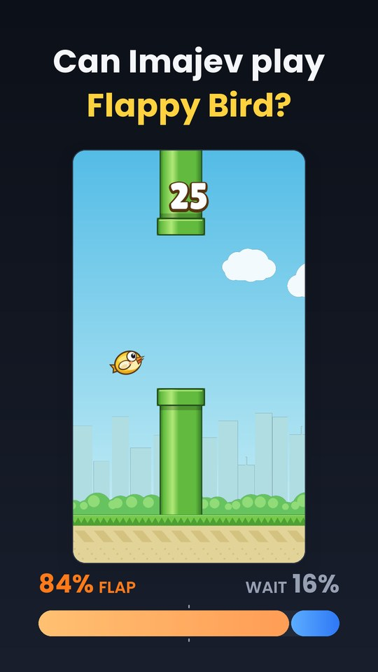
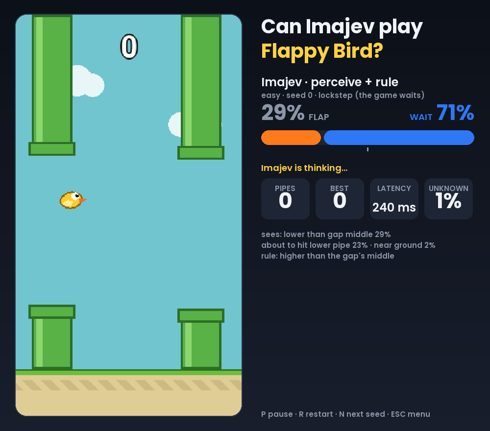

# Can Imajev play Flappy Bird?

<p align="center">
  
  &nbsp;
  
</p>

An open "System One" decision model, [imajev-4b](https://huggingface.co/mohit67890/imajev-4b), plays a small Flappy
Bird clone **from screenshots only**: no coordinates, no game state, just the game window. imajev is a Qwen3.5-4B
LoRA with a classification readout: you send an image and typed questions, and one forward pass per question returns
a probability for each answer, plus an `unknown` probability. No text is generated.

This repo has the game, the agents, a desktop app to watch (or play) live, video recording, and a benchmark.

## How it plays

Every few physics steps the game sends the current frame to the imajev server with three questions:

| question | answer |
|---|---|
| Is the yellow bird higher or lower than the middle of the opening between the next pair of green pipes? | higher / lower |
| The yellow bird is about to hit the lower green pipe in front of it. | yes / no |
| The yellow bird is close to the ground at the bottom. | yes / no |

A three-line rule turns the answers into an action: flap if the bird is near the ground or about to hit the lower
pipe, otherwise flap if it is lower than the middle of the gap; if `unknown` wins the first question, wait.

Asking the decision directly ("Should the bird flap now to pass through the next gap?") does not work: that agent
crashes within two seconds in every game. Asking what the model *sees* does.

## Quick start

Requirements: [uv](https://docs.astral.sh/uv/) and Python 3.11-3.13 (uv installs it). For Imajev itself: Linux with
an NVIDIA GPU (~10 GB of VRAM; ~14.5 GB with `--fast`) or an Apple-silicon Mac, and ~10 GB of disk.

```bash
git clone https://github.com/AndreAmaduzzi/flappy-bird-imajev.git && cd flappy-bird-imajev
uv sync

# 1. Try the app right away: play yourself, or watch the oracle and the random baseline (no model needed)
uv run python app.py

# 2. Install and start imajev (the official server; downloads Qwen3.5-4B and the imajev-4b adapter)
scripts/setup_imajev.sh
scripts/serve_imajev.sh                 # http://127.0.0.1:8765; add --fast on CUDA after the GPU/port arguments

# 3. Watch Imajev play
uv run python app.py
```

The server can run on another machine (`uv run python app.py --url http://gpu-box:8765`). The first request after
the server starts takes a few seconds (kernel compilation); the app warms it up before the game starts.
The macOS (MLX) path follows the model card and is not tested here.

## The app

`uv run python app.py` opens a window with a settings menu, then plays live: the game on the left; on the right
the FLAP / WAIT probabilities, what Imajev perceived, the decision latency, the unknown probability, pipes and best.

| setting | choices |
|---|---|
| Player | Imajev · perceive + rule, Imajev · direct question, Oracle (reads the game state), Random, You |
| Difficulty | easy / medium / hard presets (gap 190 / 165 / 140 px, faster pipes and bigger gap jumps as it gets harder) |
| Gap, Pipe speed, Gravity | change any preset value |
| Graphics | Flat, Day, Day with a plain background, Sunset, Night. Imajev sees exactly this game window; the flat graphics play best |
| Timing | Lockstep (the game waits for each decision) or Real time (the bird keeps falling while Imajev thinks) |
| Real-time speed | 1x, 0.5x, 0.25x, 0.125x: how much slower the game would have to be |
| Decide every | physics steps between decisions (default 4 = 15 decisions per game second) |
| Seed | same seed, same pipes |

Keys: menu UP/DOWN/LEFT/RIGHT, ENTER to start (or the mouse); in game SPACE (or click) to flap when you play,
P pause, R restart, N next seed, ESC menu.

## Command line

```bash
uv run python play.py --agent perceive_rule --seed 0 --difficulty easy            # play once, print the metrics
uv run python play.py --agent perceive_rule --record runs/videos/demo.mp4         # also record (9:16 and 1:1)
uv run python play.py --agent perceive_rule --seed 8 --theme day \
    --formats reel --record runs/videos/imajev.mp4                                # the 9:16 reel above
uv run python play.py --agent direct --realtime --speed 0.25                      # real time at a quarter speed
uv run python play.py --agent oracle --difficulty hard --gap 150 --pipe-speed 3.5 # change preset parameters
uv run python play.py --agent perceive_rule --set on_unknown=known                # agent options
```

`play.py -h` lists everything. Each decision is written to a JSONL log (`runs/play/...`): probabilities, unknown,
latency, the action, and the true game state for plotting. Agent options (`--set key=value`): `perceive_rule` takes
`lower_threshold`, `danger_threshold`, `on_unknown` (`wait` or `known`) and `cooldown`; `direct` takes `variant`,
`threshold` and `with_state`.

### Benchmark

```bash
scripts/serve_imajev.sh 0 8765 --fast & scripts/serve_imajev.sh 1 8766 --fast &   # one server per GPU
uv run python benchmark.py --seeds 5 --difficulties easy,medium,hard \
    --configs oracle,random,direct,perceive_rule,direct+2f,perceive_rule+2f \
    --urls http://127.0.0.1:8765,http://127.0.0.1:8766 --out runs/bench/lockstep
uv run python benchmark.py --seeds 5 --difficulties easy --max-seconds 60 \
    --configs perceive_rule+rt,perceive_rule+rt0.5,perceive_rule+rt0.25,perceive_rule+rt0.125 --out runs/bench/realtime
```

A config is an agent plus `+2f` (previous and current frame), `+rt` (real time) or `+rt0.25` (real time at a quarter
of the speed). Each server plays one game at a time; re-running skips finished games. Outputs: per-game CSV/JSONL,
a summary (`summary.md`, `summary.csv`) and every decision.

## Results

One RTX 3090 per server, imajev-4b with 1 option rotation and the shipped calibration, flat graphics, 5 seeds per
cell, a decision every 4 physics steps, 2-minute game cap. Full tables in [`results/`](results/).

**Lockstep.** Pipes passed per game, mean (median / max):

| agent | easy | medium | hard | per decision |
|---|---|---|---|---|
| oracle (true game state) | 74 (survives every game) | 99 (survives) | 126 (survives) | 2 ms |
| **Imajev · perceive + rule** | **47.8** (67 / 74) | 5.2 (3 / 17) | 3.4 (1 / 12) | 249 ms |
| Imajev · perceive + rule, 2 frames | 16.0 (12 / 41) | 8.8 (8 / 19) | 3.0 (2 / 8) | 436 ms |
| Imajev · direct question (1 or 2 frames) | 0 | 0 | 0 | 84 / 148 ms |
| random (tuned flap rate) | 0.2 | 0.2 | 0 | - |

- On easy, perceive + rule passed 67, 73, 24, 74 (survived the cap) and 1 pipes. It agrees with the oracle on 86% of
  its decisions; the direct question on 34%, less than random play (51%).
- `unknown` behaves sensibly: it wins when no pipe is on screen yet, and mostly while the bird is between the walls
  of a pipe. The direct question answers unknown a third of the time.
- Harder presets break it: the deaths are misreadings while the bird is between the pipe walls.
- The detailed graphics are harder to read than the flat ones: on easy, seeds 0-9, the day theme averages 6 pipes
  and the day theme without skyline and bushes 14.

**Real time.** The game keeps running while Imajev thinks (perceive + rule, easy):

| game speed | the decision lands | pipes, mean |
|---|---|---|
| 1x | 16 physics steps late | 0: the bird hits the ground before the first pipe appears |
| 0.5x | 8 steps late | 1.4 |
| 0.25x | 4 steps late | 3.8 |
| 0.125x | 2 steps late | 10.4 |
| lockstep | on time | 47.8 |

Even at an eighth of the speed (as if the model were 8x faster) play reaches a fifth of lockstep.

Latency per decision (RTX 3090, PyTorch backend with `--fast` and flash-linear-attention): one question ~85 ms,
three questions ~250 ms. On PyTorch each question is its own forward pass.

## How the questions were chosen

`scripts/make_frame_bank.py` renders 360 labelled frames (real pipe layouts, the bird placed at random heights and
speeds, labels from the true state); `scripts/eval_perception.py` scores every question in
[`flappy/prompts.py`](flappy/prompts.py) on them: accuracy, AUC, unknown rate, Brier score and ECE with and without
calibration.

| question | accuracy | AUC |
|---|---|---|
| higher / lower than the gap's middle | 92.8% | 0.98 |
| about to hit the lower pipe | 86.4% | 0.98 |
| close to the ground | 87.8% | 0.99 |
| above / inside / below the gap | 64.7% | - |
| "Should the bird flap now...?" | 41.4% (25.6% on frames where only one action survives) | 0.66 |
| next pipe close horizontally, bird falling (tilt) | ~41% | ~0.5 |

What did not help: 3 option rotations (3x the latency, worse play on medium), upscaling frames to the model's
400,000-pixel limit, rewording the middle question, a guard against the upper pipe, a flap cooldown. The shipped
calibration (one temperature, T = 1.305) never changes a decision; on these perception questions it makes the
probabilities slightly underconfident.

The game physics was tuned for this: a flap rises ~38 px (a fifth to a quarter of the gap). With bigger flaps even
perfect perception plus the same rule overshoots into the upper pipe. The oracle survives a 5-minute cap on every
preset.

## Project layout

```
app.py                     desktop app (pygame)
play.py, benchmark.py      command-line play / recording, and the benchmark
flappy/game.py             deterministic physics and difficulty presets
flappy/live.py             live play for the app (lockstep, real time, human)
flappy/loop.py             headless game loop and the JSONL decision log
flappy/imajev_client.py    POST /v1/systemone client (multipart, frames resized to <= 400k pixels)
flappy/prompts.py          every question sent to the model
flappy/agents/             perceive_rule, direct, oracle, random
flappy/render.py, art.py   flat and detailed graphics, the video panel
flappy/record.py, reel.py  MP4 recording through ffmpeg (9:16, 1:1, reel)
scripts/                   setup_imajev.sh, serve_imajev.sh, frame bank, perception eval, random-rate tuning
results/                   the benchmark and perception tables above
tests/                     uv run pytest
```

Recording needs `ffmpeg` with libx264 on the PATH. Everything else is Python.

## Credits and licence

- [imajev](https://github.com/mohit67890/imajev) and [imajev-4b](https://huggingface.co/mohit67890/imajev-4b) by
  mohit67890 (Apache-2.0), on [Qwen3.5-4B](https://huggingface.co/Qwen/Qwen3.5-4B) (Apache-2.0). Not included:
  `scripts/setup_imajev.sh` installs them.
- Fonts: Poppins and Lilita One, SIL Open Font License 1.1 (`assets/fonts/`).
- The game and all its graphics are original; nothing from the original Flappy Bird is used.

This repository is licensed under the [Apache License 2.0](LICENSE).
